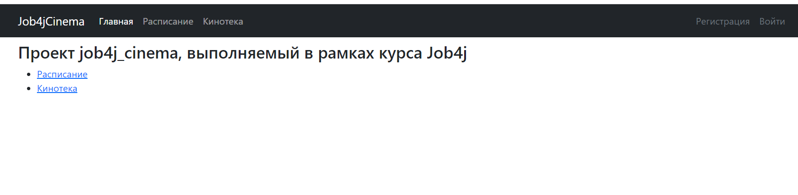
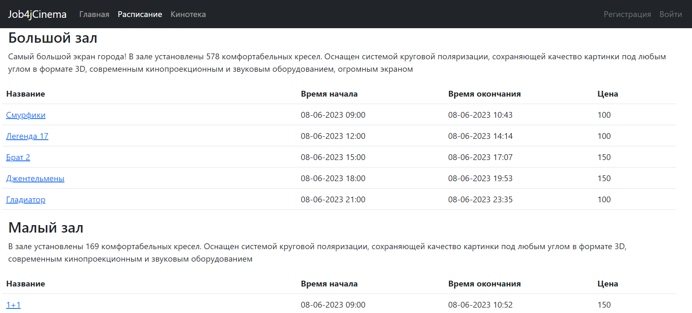
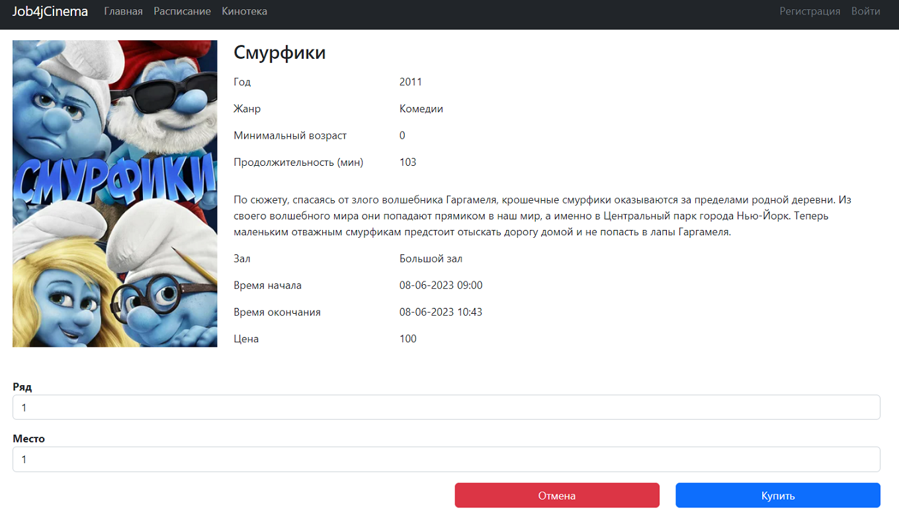
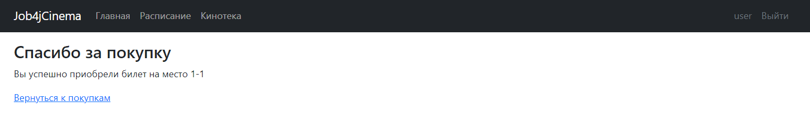
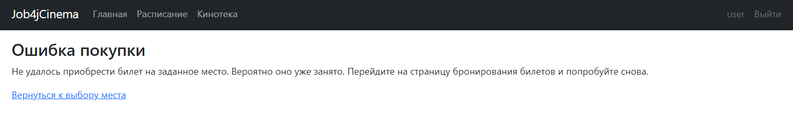
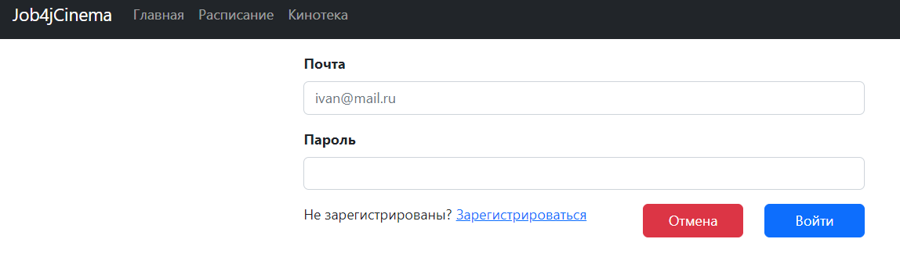
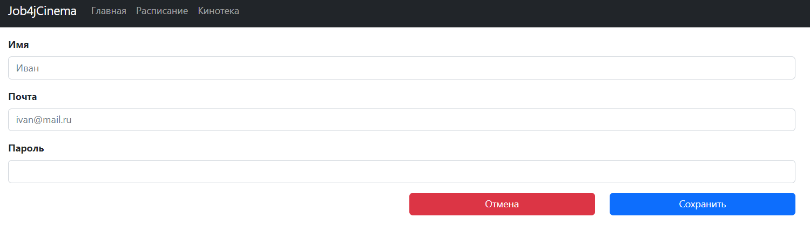

<h3>Job4j_Cinema</h3>

    Это учебное приложение - часть сервиса по онлайн бронированию билетов в кинотеатр. 
    На сайте пользователь может посмотреть актуальные сеансы и выбрать удобные места и время сеанса.
    Для покупки билета пользователь должен войти на сайт под своим логином и паролем или пройти регистрацию.

<h4>Технологии</h4>
<ul>
    <li>Java 17</li>
    <li>Spring boot 2.7.6</li>
    <li>PostgreSQL 13, Sql2o 1.6, Liquibase 4.15</li>
    <li>Log4j 1.2.17, Slf4j 1.7.30</li>
    <li>JUnit, Mockito</li>
    <li>Maven 3.8.5, Tomcat</li>
    <li>Thymeleaf, Bootstrap</li>
</ul>

<h4>Требования к окружению</h4>
<ul>
    <li>JDK 17</li>
    <li>Maven 3.8.5</li>
    <li>PostgreSQl 13</li>
    <li>Браузер</li>
</ul>

<h4>Запуск проекта</h4>
<ul>
    <li>Создать базу данных cinema "jdbc:postgresql://localhost:5432/cinema"</li>
    <li>Собрать jar с приложением, выполнив команду "mvn/install"</li>
    <li>Запустить приложение командой java "-jar job4j_cinema"</li>
    <li>Перейти в браузере по ссылке "http://localhost:8080/index"</li>
</ul>

<h4>Скриншоты с интерфейсом приложения</h4>

Главная страница 
    

Расписание 
    

Кинотека 
    

Покупка билета 
    

Успешная покупка 
    

Ошибка покупки 
    

Страница входа 
    

Страница регистрации 
    

